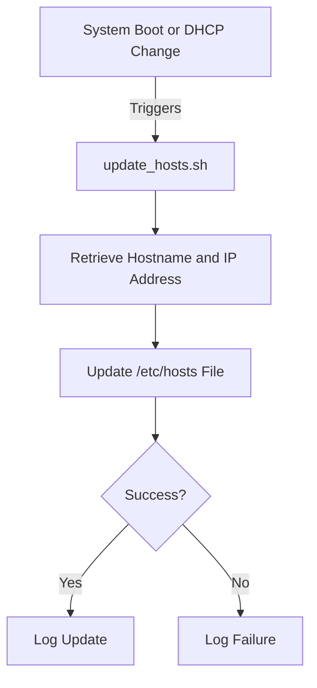

# proxmox-dynamic-hosts-file
A dynamic hosts file script for proxmox

## Hostname Updater

## Overview
The Hostname Updater is a utility designed to ensure that the `/etc/hosts` file on a Linux system is updated with the correct IP address for the current hostname. This tool is useful for systems where dynamic IP allocation may cause mismatched entries in the hosts file.

## Components
1. **Update Script**: A shell script (`update_hosts.sh`) that fetches the current hostname and primary IP address and updates `/etc/hosts` accordingly.
2. **Installer Script**: A shell script (`installer.sh`) to install the update script, including setting it up as a cron job and a DHCP client exit hook.
3. **Uninstaller Script**: A shell script (`uninstall.sh`) to remove the update script, cron job, and DHCP client hook.
4. **Tests**: A suite of tests to verify that the script correctly updates the hosts file.

## Installation
1. Clone or download this repository to your system.
2. Run the installer script:
   ```bash
   sudo ./installer.sh
   ```

The installer will:
- Place the `update_hosts.sh` script in `/usr/local/bin`.
- Set up a cron job to ensure the script runs at system boot.
- Install the script as a DHCP client exit hook at `/etc/dhcp/dhclient-exit-hooks.d/update-etc-hosts`.

## Uninstallation
1. Run the uninstaller script:
   ```bash
   sudo ./uninstall.sh
   ```

The uninstaller will:
- Remove the `update_hosts.sh` script from `/usr/local/bin`.
- Delete the cron job file.
- Remove the DHCP client exit hook.

## Usage
The script runs automatically at boot and when DHCP changes occur, but it can also be executed manually:
```bash
sudo /usr/local/bin/update_hosts.sh
```

## Testing
Tests are provided to verify the functionality of the update script.

### Run Tests
1. Ensure you have `bash` installed on your system.
2. Execute the test script:
   ```bash
   ./test_update_hosts.sh
   ```

The test suite checks:
- Correct determination of the system's hostname.
- Accurate retrieval of the primary IP address.
- Proper modification of the `/etc/hosts` file.
- Backup of the `/etc/hosts` file before changes.

## Architecture Diagram
The following diagram illustrates the components and flow of the Hostname Updater:



## License
This project is licensed under the MIT License. See the LICENSE file for details.

## Contributions
Contributions and improvements are welcome! Please submit pull requests or open issues for any suggestions or bugs.

